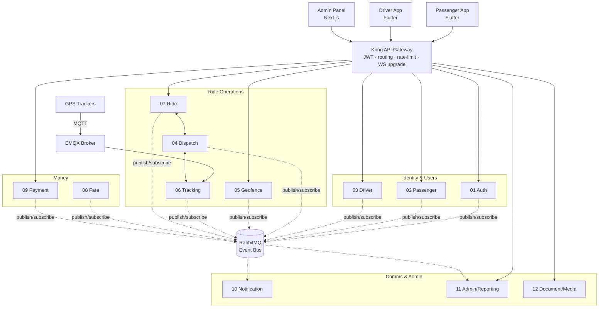

# Backend Architecture — 12 Microservices

**Doc:** `architecture.md` · **Version:** 1.0 · **Status:** Baseline for build
**Supersedes ambiguities in:** SDD-ET-001 (choices committed in `techstack.md`)

---

## 1. Topology



**Rules (from SDD, enforced):**
1. Only Kong is internet-facing. Services live on a private network / cluster namespace.
2. Database-per-service; cross-service data access only via API or events.
3. Sync (REST) for request–response; async (RabbitMQ) for state-change fan-out.
4. Each service: own Docker image, Helm chart, pipeline, horizontal scaling.
5. Real-time paths (GPS, dispatch) served from Redis; durable history in TimescaleDB.

---

## 2. Service Responsibilities & Interfaces

| # | Service | Owns | Sync API consumers | Publishes | Subscribes |
|---|---|---|---|---|---|
| 01 | **Auth** | Identities, OTP, JWT (RS256), refresh tokens, roles, device binding | all apps via GW | `user.registered` | — |
| 02 | **Passenger** | Passenger profiles, saved methods (tokens only), block status | Passenger app, Ride, Reporting | `passenger.updated` | `ride.completed` (history proj.) |
| 03 | **Driver** | Driver & vehicle registry, documents meta, driver↔vehicle binding, online/offline, suspension | Driver app, Dispatch, Ride | `driver.status.changed`, `vehicle.updated`, `driver.suspended` | `geofence.violation.escalated` |
| 04 | **Dispatch** | Matching rounds, offers, expansion, atomic accept claim | Ride (internal) | `dispatch.offer.broadcast`, `dispatch.assigned`, `dispatch.exhausted` | `ride.requested`, `driver.status.changed` |
| 05 | **Geofence** | Zone CRUD (PostGIS), vehicle↔zone pairing, containment checks, violation lifecycle, movement passes | Admin, Dispatch, Tracking | `geofence.violation.detected/closed/escalated`, `zone.updated` | `vehicle.location.updated` (sampled), `ride.*` (authorization ctx) |
| 06 | **Tracking** | MQTT ingestion, live Redis GEO, TimescaleDB history, trail slices, tracker health | Dispatch, Admin map (WS), Ride | `vehicle.location.updated` (30 s sampled), `tracker.stale` | `ride.started/completed` (trail binding) |
| 07 | **Ride** | Ride state machine (specs §3), ride records, cancellation, no-show, **saga orchestration** | apps, Admin | `ride.requested/assigned/started/completed/cancelled`, `ride.payment_pending` | `dispatch.assigned/exhausted`, `fare.calculated`, `payment.completed/failed` |
| 08 | **Fare** | Versioned fare configs, fare computation, adjustments | Ride (internal), Admin | `fare.calculated`, `fare.config.changed` | `ride.ended` (compute trigger) |
| 09 | **Payment** | Payment attempts, gateway integration (JazzCash/1LINK), idempotency, refunds, reconciliation | Passenger app, Admin | `payment.completed/failed/refunded` | `fare.calculated` |
| 10 | **Notification** | Templates (EN/UR), FCM + SMS dispatch, delivery status | Admin (templates) | `notification.sent/failed` | nearly all domain events (matrix specs §10) |
| 11 | **Admin/Reporting** | Materialized read models (`reporting_db`), dashboards, reports, CSV export, audit-log query | Admin panel | — | **all** domain events (projections) |
| 12 | **Document/Media** | Uploads (license, CNIC, receipts), signed URLs, virus scan hook | Driver app, Admin, Payment (receipts) | `document.uploaded/verified` | — |

---

## 3. Communication Patterns

### 3.1 Synchronous (REST over cluster DNS)
- Used when the caller needs an immediate answer: Dispatch→Tracking ("free vehicles in zones A,B,C"), Ride→Fare ("compute fare for trail X") — candidates for gRPC only if profiling demands (techstack §2).
- Rules: timeouts (default 2 s), retries with jitter (idempotent GETs only), circuit breaker (opossum) in the shared lib. No sync call chains deeper than 2 hops.

### 3.2 Asynchronous (RabbitMQ topic exchange `itms.events`)
- Routing key = event name (`ride.completed`). Each service binds a **durable queue** with its own bindings; consumer prefetch 20.
- **Delivery contract: at-least-once.** Every consumer MUST be idempotent (dedupe on `event_id`).
- Failures → per-queue DLQ after 3 retries (exponential backoff via delayed-message plugin). DLQs are monitored and alertable; replay tooling is a shared-lib CLI.

### 3.3 Outbox pattern (mandatory for publishers)
Every service that publishes events writes the event to an `outbox` table **in the same DB transaction**
as its state change; a relay (polling publisher, shared lib) delivers to RabbitMQ and marks sent.
This guarantees no "state changed but event lost" and gives Dispatch its durable journal.

### 3.4 Ride completion saga (orchestrated by Ride Service)
The ride → fare → payment flow crosses three services/DBs. The Ride Service acts as saga orchestrator:

```
End Ride (driver)
  → Ride: state = ENDED (uncommitted fare), emit ride.ended [outbox]
  → Fare: consumes, computes, emits fare.calculated
  → Ride: state = PENDING_PAYMENT (fare attached), emit ride.payment_pending
  → Payment: attempt(s) …
      success → payment.completed → Ride: state = COMPLETED, receipt task → Document
      failure → payment.failed   → Ride: stays PENDING_PAYMENT (retry/switch, specs §8)
Compensations:
  - Fare compute error → ride flagged FARE_ERROR, admin queue, driver instructed to hold passenger receipt; manual fare entry allowed (audited).
  - Payment stuck > 30 min → cash-fallback instruction (specs §8.2).
```
Timeout watchdogs live in the Ride Service (scheduled scans on stuck states) — no distributed transactions, no 2PC anywhere.

### 3.5 Real-time to clients
- WebSocket gateway path: clients connect via Kong (WS upgrade) to the **Ride Service** WS namespace for ride-state streams, and Admin connects to **Tracking** WS for the live map.
- Server push is fed by the same domain events (services consume bus → push to their connected sockets). Sticky sessions via Kong; socket state in Redis so any replica can serve.

---

## 4. Data Layer

| Store | Role | Notes |
|---|---|---|
| PostgreSQL 16 (per service) | System of record | One HA cluster, isolated logical DBs + per-service creds (techstack §5) |
| PostGIS (`geofence_db`) | Zone geometry, containment | Zone geometries also cached in Redis for hot-path checks |
| TimescaleDB (`tracking_db`) | GPS history hypertables | Compression after 7 days; continuous aggregates for km/day reports |
| Redis 7 | Live vehicle GEO, dispatch claims/state, session cache, WS presence, rate-limit counters | Persistence AOF everysec; **not** a system of record |
| MinIO / S3 | Documents, receipts, GPS archives | Versioned bucket, signed URLs only |
| `reporting_db` | CQRS read models | Rebuildable from events; rebuild runbook in devops.md |

## 5. Cross-Cutting

- **Service discovery:** Kubernetes DNS (`http://ride.itms.svc`). Consul not needed on K8s (decision).
- **Config & secrets:** K8s ConfigMaps + Sealed Secrets (or cloud secret manager); no secrets in images or repo.
- **Observability:** OpenTelemetry SDK in the shared lib → traces (Tempo), metrics (Prometheus), logs (Loki, structured JSON with `trace_id`, `ride_id` correlation). Golden dashboards per service + business dashboards (rides/hour, match rate, violation rate).
- **API versioning:** URI prefix `/v1/`; additive changes preferred; breaking change = new version, N-1 supported for one release cycle.
- **Multi-tenancy/city:** single tenant v1; `city_id` column reserved on zone/vehicle/ride tables to avoid painful retrofit (N-11).

## 6. Scaling model

| Hot spot | Scale mechanism |
|---|---|
| Tracking ingestion | EMQX shared subscriptions → N Tracking replicas; Redis pipeline writes |
| Dispatch | Stateless replicas; atomicity via Redis claims; shard by ride id if ever needed |
| WS fan-out | Redis pub/sub backplane between replicas |
| Reporting queries | Isolated `reporting_db` — heavy analytics never touch transactional DBs |

## 7. Deviations from SDD-ET-001 (recorded)

1. **RabbitMQ over Kafka** for v1 with a defined migration trigger (techstack §4).
2. **REST-first internal**, gRPC only where profiling justifies.
3. **Consul dropped** — Kubernetes DNS suffices.
4. **CQRS given a concrete read store** (`reporting_db`) instead of "event-stream reads".
5. **Outbox + saga** added — SDD named no consistency mechanism.
6. One physical Postgres cluster with logical isolation in v1 (ownership rules unchanged).
